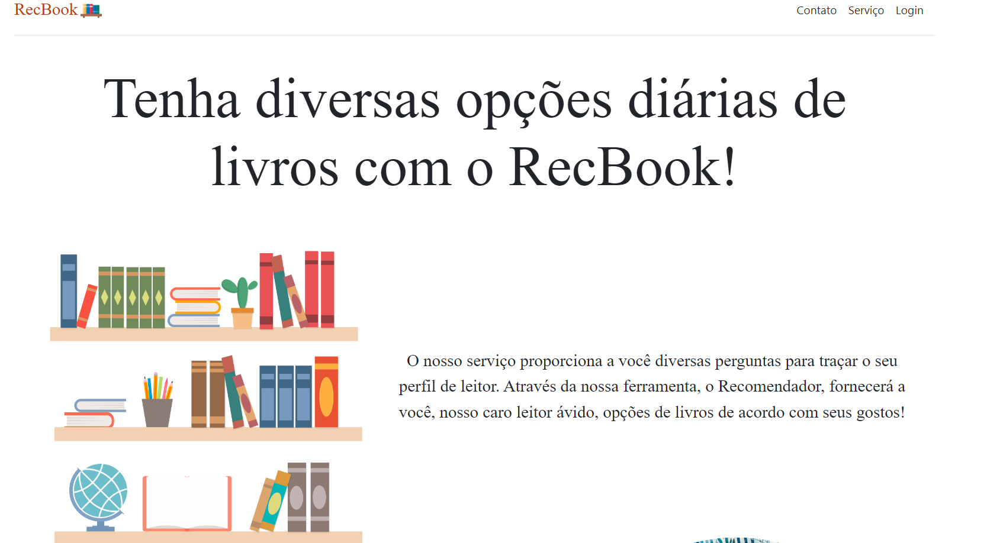

# Projeto em Squad Módulo 2
Nosso grupo formado por 5 pessoas diferentes e com pensamentos e ideias tão distintas quanto, planejamos e executamos essa página e produto para empresa FrontEnders. O seu nome vem da junção do "rec" de recomendação e "book" da palavra "livro" em inglês! O objetivo é recomendar livros para leitores que querem explorar seus gêneros literários favoritos. Executamos um site responsivo, minimalista e prático no qual consegue agradar todos os públicos. Sua execução pode ser feita pelo mobile ou desktop.

A webpage pode ser acessada por esse link: https://xandyninfadora.github.io/M2_Projeto_Squad/index.html

<h3> Como rodar o projeto:</h3>
<h4> Você pode clonar o projeto e rodá-lo localmente seguindo os passos a seguir</h4>
<ol>
<li> Comece com o git clone no link https://github.com/XandyNinfadora/ProjetoSquadM2/ para a clonagem do mesmo </li>
<li> Escolha o navegador de sua preferência </li>
<li> Abra o arquivo index.html no seu navegador </li>
</ol>

## Scripts utilizados
- Bootstrap;
- ViaCep;
- Swiper Carousel.

 
